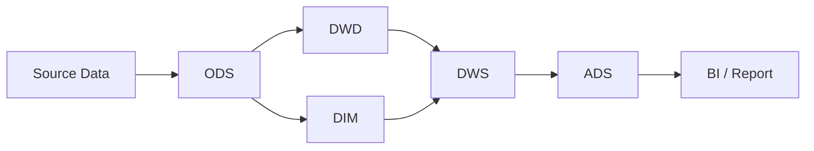
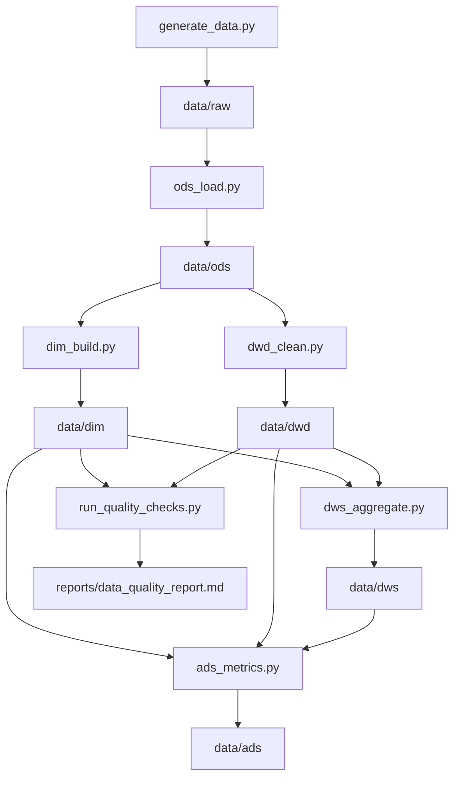

# RetailPulse：电商零售离线湖仓与经营分析平台

本项目面向电商零售业务，构建从模拟数据生成、ODS/DWD/DIM/DWS/ADS 分层加工到经营指标分析的离线湖仓项目，用于展示大数据开发、数仓建模、Spark 批处理和数据质量治理能力。

## 技术栈

Python、PySpark、Spark SQL、Parquet、Docker、PostgreSQL/MinIO 可选、Makefile、pytest。

企业级扩展组件：Hadoop、Hive、Spark standalone/YARN 思路、Kafka、Zookeeper、HBase、Flink、Sqoop、Maven。

## 架构图



## 数据流图



## 目录结构

```text
retailpulse-offline-lakehouse/
  README.md
  requirements.txt
  pyproject.toml
  Makefile
  .env.example
  docker-compose.yml
  scripts/
    generate_data.py
    run_all.py
    run_all.ps1
    run_quality_checks.py
  jobs/
    ods_load.py
    dwd_clean.py
    dim_build.py
    dws_aggregate.py
    ads_metrics.py
  sql/
    ods/
    dwd/
    dim/
    dws/
    ads/
  data/
    raw/
    ods/
    dwd/
    dim/
    dws/
    ads/
  docs/
    PROJECT_PLAN.md
    AGENTS.md
    ARCHITECTURE.md
    BUSINESS_PROCESS.md
    DATA_WAREHOUSE_DESIGN.md
    METRICS.md
    SPARK_OPTIMIZATION.md
    PUBLIC_DATASETS.md
    DASHBOARD.md
    INTERVIEW_QA.md
    REFERENCES.md
  dashboard/
    index.html
    data/
  reports/
    data_quality_report.md
    metric_samples.md
  tests/
    test_data_generator.py
    test_data_quality.py
    test_metric_logic.py
```

## 本地运行步骤

建议先使用 `tiny` 规模验证链路。

```bash
python -m venv .venv
.\.venv\Scripts\activate
pip install -r requirements.txt
python scripts/run_all.py --scale tiny --start-date 2025-01-01 --days 90
pytest
```

Windows PowerShell：

```powershell
.\scripts\setup_windows_spark.ps1
.\scripts\run_all.ps1 -Scale tiny -StartDate 2025-01-01 -Days 90
```

说明：Windows 本地 PySpark 写 Parquet 时通常需要 `HADOOP_HOME/bin/winutils.exe` 和 `hadoop.dll`。`run_all.ps1` 会在未配置 `HADOOP_HOME` 时自动调用 `setup_windows_spark.ps1`，在 `.runtime/hadoop/bin/` 下准备本项目本地使用的 Windows Hadoop 工具，并把该目录加入当前会话的 `PATH`。

Makefile：

```bash
make install
make all SCALE=tiny
make test
```

## 企业级模式

本项目已支持把大数据组件安装到 E 盘企业级本地运行时目录：

```text
E:\RetailPulseEnterprise
```

安装和应用配置：

```powershell
conda activate retailpulse-lakehouse
cd E:\Projects\retailpulse-offline-lakehouse

.\scripts\setup_enterprise_components.ps1
.\scripts\apply_enterprise_configs.ps1
.\scripts\check_enterprise_env.ps1
```

Makefile 等价命令：

```bash
make enterprise-setup
make enterprise-config
make enterprise-check
```

企业级配置模板位于 `configs/enterprise/`，部署说明见 `docs/ENTERPRISE_DEPLOYMENT.md`，架构扩展见 `docs/ENTERPRISE_ARCHITECTURE.md`。

说明：企业级模式现在从 Apache/Redis 官方下载合适版本，默认安装到 `E:\RetailPulseEnterprise`，并持久化到当前 Windows 用户环境变量。Spark 版本为 3.5.8，与项目 `pyspark` 版本保持一致；Sqoop 1.4.7 已补充 `commons-cli-1.2.jar` 兼容配置用于本地版本检查。

## 企业级公开数据

项目新增真实公开大规模数据入口，默认选择 RecSys Challenge 2025 / Synerise 在线零售数据集，压缩包约 1.9GB，低于 40GB，下载到项目根目录下的 `external_data/synerise-recsys-2025/`。

```powershell
python scripts/download_public_data.py --dataset synerise-recsys-2025 --extract
```

说明见 `docs/PUBLIC_DATASETS.md`。

当前本机已完成下载和解压，总占用约 4.35GB，数据画像见 `reports/public_dataset_profile.md`。

Synerise 真实行为数据已支持进入数仓 ODS/DWD：

```powershell
python scripts/run_synerise_pipeline.py --input external_data/synerise-recsys-2025/extracted --data-root data
```

输出表包括 `ods_synerise_*`、`dwd_synerise_user_behavior_detail`、`dws_synerise_*` 和 `ads_synerise_*`，覆盖真实行为明细、每日汇总、漏斗转化和商品/品类 TopN。本地烟测可以使用：

```powershell
python scripts/run_synerise_pipeline.py --data-root data_synerise_smoke --limit-per-table 10000 --output-partitions 4
```

全量入仓验收见 `reports/synerise_pipeline_report.md`：当前已写入 DWD 真实行为明细 225,224,262 行，并产出 Synerise 行为 DWS/ADS 指标。

## 可视化大屏

大屏位于 `dashboard/index.html`，读取 ADS 指标导出的 `dashboard/data/dashboard.json`。当前版本是全中文字体的企业级 3D 沉浸式数据指挥中心，采用 `100vw × 100vh` 全屏驾驶舱布局和微软雅黑优先字体栈，包含 WebGL 粒子/光线背景、悬浮发光图表面板、中心转化核心、折线/面积/3D 柱状/散点/热力图、日期筛选、指标筛选、纵深调节、悬停 tooltip 和图表联动。

```powershell
python scripts/export_dashboard_data.py --data-root data --external-root external_data/synerise-recsys-2025/extracted --output dashboard/data/dashboard.json --topn 10
python scripts/serve_dashboard.py --port 8508
```

浏览器打开：

```text
http://127.0.0.1:8508
```

等价 Makefile：

```bash
make dashboard-data
make dashboard-serve
```

说明见 `docs/DASHBOARD.md`。

分步执行：

```bash
make generate SCALE=tiny
make ods
make dwd
make dim
make dws
make ads
make quality
```

## 数据规模

默认规模用于完整项目展示：

| 表 | 默认行数 |
| --- | ---: |
| users | 10,000 |
| products | 5,000 |
| shops | 500 |
| orders | 300,000 |
| order_items | 600,000 |
| payments | 260,000 |
| refunds | 30,000 |
| user_events | 2,000,000 |
| inventory_logs | 300,000 |

本地快速验证可使用 `--scale tiny` 或 `--scale small`。

## 指标样例

核心指标包括：

- GMV、订单量、支付订单量、支付金额
- 下单用户数、支付用户数、支付转化率、客单价
- 退款率、复购率、次日留存率、7 日留存率
- 商品销售 TopN、品类销售 TopN、店铺销售排行
- RFM 用户分层、库存周转率

指标 SQL 位于 `sql/ads/`，口径说明位于 `docs/METRICS.md`。

## 数据质量校验样例

运行：

```bash
python scripts/run_quality_checks.py --input data --output reports/data_quality_report.md --start-date 2025-01-01 --end-date 2025-03-31
```

检查项包括：

- 主键重复
- 关键字段为空
- 订单金额异常
- 支付金额与订单金额不一致
- 支付时间早于下单时间
- 退款金额大于支付金额
- 维表关联缺失
- 每日分区为空
- 用户行为事件类型非法
- 库存流水数量异常

## Spark 优化点

- ODS 之后统一使用 Parquet，减少 IO 并支持列裁剪。
- 所有事实表和指标表按 `dt` 分区，支持单日增量和重跑。
- 商品、店铺等维表关联使用 broadcast join。
- 多次复用的订单明细和支付流水使用 cache/persist。
- 聚合、窗口和 join 前尽量按日期过滤。
- 输出前使用 coalesce 控制本地小文件数量。
- 亿级扩展时可迁移到 Spark 集群、对象存储和 Delta/Iceberg/Hudi 表格式。

详细说明见 `docs/SPARK_OPTIMIZATION.md`。

## 项目难点

1. 指标口径需要和业务流程一致，例如 GMV 与支付金额必须区分。
2. 订单表和订单明细表粒度不同，计算订单指标时要避免明细行重复。
3. 留存、复购、RFM 属于用户视角指标，需要和交易事实表正确关联。
4. 本地项目既要能跑通，又要保留真实数仓项目的分层和性能优化思想。
5. 数据质量检查要覆盖业务规则，而不只是检查文件是否存在。

## 简历写法

RetailPulse 电商零售离线湖仓与经营分析平台：

- 独立设计电商零售业务数据模型，覆盖用户、商品、店铺、订单、支付、退款、行为和库存等主题。
- 使用 PySpark 构建 ODS/DWD/DIM/DWS/ADS 离线数仓链路，基于 Parquet 和 `dt` 分区模拟湖仓存储。
- 实现 GMV、支付转化率、客单价、退款率、复购率、留存、商品 TopN、RFM 用户分层和库存周转等核心指标。
- 引入主键重复、金额一致性、时间顺序、维表关联、分区完整性等数据质量校验，并输出 Markdown 报告。
- 在 Spark 作业中使用 broadcast join、persist、分区裁剪和小文件控制等优化手段，支持本地和可扩展集群模式。

## 3 分钟面试讲解稿

这个项目是我独立设计的电商零售离线湖仓项目，业务上模拟一家电商平台每天产生用户、商品、订单、支付、退款、行为和库存数据。项目目标是把这些源数据加工成可用于经营分析的指标体系。

技术上，我用 Python 生成 90 天模拟数据，用 PySpark 构建从 raw 到 ODS、DWD、DIM、DWS、ADS 的完整链路。ODS 保留原始结构，DWD 做去重、状态标准化和金额校验，DIM 沉淀用户、商品、店铺、品类和日期维度，DWS 做交易、用户、商品、店铺、品类、留存和库存主题汇总，ADS 输出看板指标。

指标上，我实现了 GMV、订单量、支付金额、支付转化率、客单价、退款率、复购率、次日和 7 日留存、商品和品类 TopN、店铺排行、RFM 用户分层和库存周转率。项目还包含数据质量检查，例如主键重复、关键字段为空、支付时间早于下单时间、退款金额大于支付金额、维表关联缺失和每日分区为空。

性能方面，我使用 Parquet 存储、`dt` 分区、broadcast join、persist 和输出文件数控制。这个项目虽然可以在 Windows 本地跑通 tiny 规模，但设计上保留了迁移到 Spark 集群和对象存储的扩展路径。

## 文档入口

- 项目计划：`docs/PROJECT_PLAN.md`
- Agent 分工：`docs/AGENTS.md`
- 业务流程：`docs/BUSINESS_PROCESS.md`
- 架构说明：`docs/ARCHITECTURE.md`
- 企业级架构：`docs/ENTERPRISE_ARCHITECTURE.md`
- 企业级部署：`docs/ENTERPRISE_DEPLOYMENT.md`
- 数仓设计：`docs/DATA_WAREHOUSE_DESIGN.md`
- 指标口径：`docs/METRICS.md`
- Spark 优化：`docs/SPARK_OPTIMIZATION.md`
- 面试问答：`docs/INTERVIEW_QA.md`
- 参考说明：`docs/REFERENCES.md`
