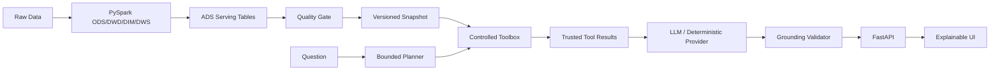

# RetailPulse Grounded Analytics Copilot

> 面向 AI 应用开发岗位的工程化作品集：**PySpark 湖仓负责可信数据，确定性的 bounded planner 负责查询规划与受控工具执行，LLM 只基于真实 ToolResult 生成可追溯经营洞察。**

项目不把关键词规则路由包装成“LLM reasoning”。当前稳定经营分析域刻意使用 deterministic planner，以换取可控权限、可评测性和清晰失败归因；当意图空间扩大时，再把 structured LLM planner 放到同一工具白名单与参数校验边界内做 shadow evaluation。

## 核心链路

```text
Raw / Public Retail Data
  -> ODS / DWD / DIM / DWS / ADS
  -> Data Quality Gate
  -> Versioned Serving Snapshot
  -> Bounded Deterministic Planner
  -> Controlled Analytics Tools
  -> Trusted Tool Results
  -> Structured LLM Synthesis
  -> Grounding Validator
  -> FastAPI / Explainable UI
  -> pytest + eval + Docker CI
```

## 项目亮点

- **真实数据底座**：完整 PySpark ODS→DWD→DIM→DWS→ADS，而不是静态 CSV 聊天 Demo。
- **受控分析执行链**：`get_kpi`、`compare_periods`、`breakdown_by_dimension`、`get_topn`、`detect_anomaly`。
- **真实多维分析**：product / category / shop / **channel** / refund_reason / user_segment。
- **渠道能力贯穿数据链**：`dim_user.channel -> dws_channel_day_summary -> ads_channel_summary -> serving JSON -> controlled tool`。
- **Grounded by construction**：LLM observation 必须引用本次成功 ToolResult 的 `evidence_key`。
- **明确能力边界**：当前不支持 `campaign`、`region`，API 返回 coverage gap，不让模型猜。
- **生产运行控制**：request ID、JSON 日志、Prometheus、API key、rate limit、version-aware cache、freshness readiness。
- **可降级**：无 API Key 或模型失败时使用 deterministic provider；CI 不依赖外部模型。
- **在线/离线解耦**：Docker API 镜像不包含 Spark/JVM。
- **多层 Eval**：retrieval、50-case planner routing、API/grounding contract、Docker smoke、Spark 数据单测和 tiny pipeline quality gate。

## 为什么不是自由式 Text-to-SQL / Autonomous Agent

当前服务面向稳定的经营分析域。Planner 只能选择白名单工具和受控参数，模型不能提供 SQL、路径、代码或任意表名。这样可以控制：

- 指标口径；
- 数据权限和暴露面；
- 查询延迟和成本；
- 资源扫描范围；
- eval 空间；
- 失败归因。

需要更灵活的 ad-hoc 分析时，优先增加 semantic query DSL 并由后端编译参数化 SQL，而不是直接把数据库执行权交给模型。若 deterministic policy 的维护成本持续上升，可增加 structured LLM planner，但输出仍必须经过 schema、tool allowlist 和 argument validation，并先与当前 planner 做离线 / shadow A/B。

## 架构



详见：`docs/ARCHITECTURE.md`、`docs/ANALYTICS_AGENT.md`、`docs/EVALUATION.md`、`docs/OPERATIONS.md`、`docs/METRICS.md`。

## Tool surface

| Tool | 作用 |
|---|---|
| `get_kpi` | 当前 KPI |
| `compare_periods` | 相邻窗口趋势/变化 |
| `breakdown_by_dimension` | 受控维度下钻 |
| `get_topn` | Top-N 排名 |
| `detect_anomaly` | 日序列异常提示 |

机器可读能力：

```bash
curl http://127.0.0.1:8000/api/v1/capabilities
```

## Channel 口径

`channel` 指用户注册/获客渠道，来自 `dim_user.channel`。它与行为日志里的 `source_channel`（单次访问来源）不同。

渠道 DWS 同时产出：

- order_count / order_user_count / GMV
- pay_order_count / pay_user_count / pay_amount
- pay_conversion_rate
- avg_order_value
- refund_order_count / refund_amount / refund_rate

因此 Copilot 可以回答“按渠道分析 GMV”“按渠道分析支付金额”等问题，而不是只把 channel 写在 prompt 里。

## 快速启动

```bash
python -m venv .venv
source .venv/bin/activate       # Windows: .\.venv\Scripts\activate
pip install -r requirements-api.txt -r requirements-dev.txt
python scripts/generate_demo_data.py
uvicorn app.main:app --reload
```

- UI: `http://127.0.0.1:8000`
- OpenAPI: `http://127.0.0.1:8000/docs`
- Readiness: `http://127.0.0.1:8000/readyz`
- Prometheus: `http://127.0.0.1:8000/metrics`

没有 `OPENAI_API_KEY` 时自动使用 deterministic provider，Planner/Tool 主链仍然完整可演示。

可选接入 OpenAI：

```bash
export OPENAI_API_KEY="..."
export OPENAI_MODEL="gpt-5"
uvicorn app.main:app --reload
```

Docker：

```bash
docker compose up --build
```

## 推荐 Demo 问题

```text
GMV 最近趋势如何？
销售额最高的 Top5 商品是什么？
为什么最近退款率上升？
按渠道分析支付金额
GMV 是否出现异常波动？
按地区分析 GMV
```

最后一个问题会明确返回 `region` coverage gap，用于演示系统如何拒绝伪造缺失维度。

## API 响应可解释性

`POST /api/v1/ask` 返回：

```text
request_id
analysis
  summary
  observations[].evidence_keys
  actions
  caveats
plan
  planner_version
  intent
  calls[]
  coverage_gaps
tool_results[]
  tool
  status
  data
  evidence_key
evidence[]
provider / model
warnings
latency_ms
cache_hit
data_version
```

前端会展示 Execution Plan、Tool Results 和最终 grounded analysis，而不是隐藏执行过程。

## 跑真实湖仓

```bash
pip install -r requirements-data.txt -r requirements-dev.txt
python scripts/run_all.py \
  --scale tiny \
  --start-date 2025-01-01 \
  --days 3 \
  --data-root data

python scripts/export_dashboard_data.py \
  --data-root data \
  --output dashboard/data/dashboard.json \
  --topn 10
```

Serving snapshot 包括核心 KPI、日趋势、渠道汇总、商品/品类 Top-N、店铺排名、RFM、退款原因、库存周转等 ADS 资产。

## Test / Eval

```bash
make lint
make test-api
make ai-eval
make tool-eval
make test-data
```

- retrieval eval：问题是否召回正确 KPI；
- planner routing eval：50 个中英混合 case，按 tool / metric / dimension / coverage gap 统计 precision、recall、F1 和 whole-case exact match；
- regression 集刻意保留 over-planning hard cases，避免“永远多调几个工具也能拿满 recall”；
- Spark metric test：验证真实生产表达式，包括 channel aggregation；
- API test：验证 plan/tool/grounding contract；
- Docker smoke：镜像启动后发送真实 Copilot 请求；
- tiny pipeline：验证 ODS→DWD→DIM→DWS→ADS + quality gate。

详见 `docs/EVALUATION.md`。简历中的任何效果数字应来自保存的固定 case-set / planner-version 报告，而不是 README 手填。

## CI

GitHub Actions 拆为三条运行边界：

1. **AI service quality**：Ruff、AI/Copilot/API tests、retrieval eval、planner routing eval。
2. **Container packaging smoke**：build/run image + readiness + 真实 Copilot HTTP 请求。
3. **Lakehouse quality and smoke**：Spark 数据单测 + tiny pipeline + data-quality artifact。

## 工程取舍

当前没有为了简历标签堆 LangChain、Vector DB、Kafka、Redis：

- 结构化指标不需要 vector retrieval；
- 当前单实例 cache/rate limiter 不需要 Redis，多实例时再迁移；
- 没有异步长任务就不引入队列；
- 小而稳定的 intent 用 deterministic planner 更容易 eval；intent 规模扩大后，再让 structured LLM planner 在相同边界下进行离线 / shadow evaluation。

每个组件都必须能解释它如何提升准确性、可靠性、可测试性、成本控制或部署能力。

## 面试重点

1. 为什么 Data Quality Gate 是 AI grounding 的上游组成？
2. bounded tools 相比 Text-to-SQL 解决了什么问题？
3. `evidence_key` 的二次校验防住什么 hallucination？
4. 为什么当前用规则 Planner，什么时候升级 LLM Planner？
5. 为什么 planner eval 不能只看 recall？
6. 比例指标做时间对比为什么不能平均 daily rate？
7. channel 为什么要先从 DIM/DWS/ADS 建模，而不是改 prompt？
8. acquisition `channel` 与 event `source_channel` 有何区别？
9. cache key 为什么包含 `data_version` 和 `planner_version`？
10. 如何区分 routing、tool/data、provider/synthesis 三类失败？
11. 为什么 production 要 fail closed，不能偷偷回退 demo 数据？
