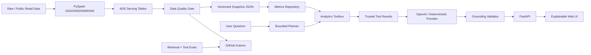

# RetailPulse Analytics Agent

> 面向 AI 应用开发岗位的生产型作品集：**PySpark 湖仓负责可信数据，受控 Analytics Agent 负责查询规划与工具执行，LLM 只基于真实工具结果生成可追溯经营洞察。**

RetailPulse 不以“组件数量”证明工程化。核心链路是：

```text
离线零售数据
  -> ODS / DWD / DIM / DWS / ADS
  -> Data Quality Gate
  -> Versioned Serving Snapshot
  -> Bounded Query Planner
  -> Controlled Analytics Tools
  -> Trusted Tool Results
  -> Structured LLM Synthesis
  -> Grounding Validator
  -> FastAPI / Explainable UI
  -> pytest + eval + Docker CI
```

## 为什么这个项目适合 AI 应用开发岗

- **真实数据工程底座**：PySpark ODS→DWD→DIM→DWS→ADS，而不是把一份静态 CSV 包装成聊天机器人。
- **Agent 有真实执行能力**：问题会被拆成受控计划并调用 KPI、分期对比、维度下钻、Top-N、异常检测工具。
- **Grounded by construction**：LLM 只看到成功执行的工具结果；每个 observation 必须引用本次 `evidence_key`。
- **拒绝“万能 Agent”叙事**：不开放任意 SQL、文件路径或代码执行；不支持的维度明确返回 coverage gap。
- **可降级**：没有 API Key 或外部模型失败时使用 deterministic provider，CI 不依赖模型网络调用。
- **可运营**：request id、结构化日志、Prometheus、API key、rate limit、version-aware cache、readiness/freshness gate。
- **可部署**：在线 Docker 镜像不包含 Spark/JVM，批处理和在线服务依赖边界清晰。
- **可评估**：retrieval eval + tool-routing eval + unit/API tests + Docker smoke + Spark end-to-end quality gate。

## 架构



详细设计见：

- [`docs/ANALYTICS_AGENT.md`](docs/ANALYTICS_AGENT.md)
- [`docs/ARCHITECTURE.md`](docs/ARCHITECTURE.md)
- [`docs/OPERATIONS.md`](docs/OPERATIONS.md)
- [`docs/METRICS.md`](docs/METRICS.md)

## Agent 工具

| Tool | 用途 | 数据边界 |
|---|---|---|
| `get_kpi` | 当前 KPI | 指标目录中的可信 KPI |
| `compare_periods` | 相邻时间窗口对比 | 日级 serving mart |
| `breakdown_by_dimension` | 维度下钻 | ADS 聚合结果 |
| `get_topn` | Top-N 排名 | ADS 排行 serving mart |
| `detect_anomaly` | 日序列异常提示 | 日级 KPI，至少 5 个观测 |

支持维度：`product`、`category`、`shop`、`refund_reason`、`user_segment`。

当前 coverage gaps：`channel`、`campaign`、`region`。当用户请求这些维度时，API 会显式返回缺失能力，不让模型补造。

查看机器可读能力：

```bash
curl http://127.0.0.1:8000/api/v1/capabilities
```

## 快速启动

### 1. 本地启动 AI 服务

```bash
python -m venv .venv
source .venv/bin/activate       # Windows: .\.venv\Scripts\activate
pip install -r requirements-api.txt -r requirements-dev.txt
python scripts/generate_demo_data.py
uvicorn app.main:app --reload
```

访问：

- UI: `http://127.0.0.1:8000`
- OpenAPI: `http://127.0.0.1:8000/docs`
- Readiness: `http://127.0.0.1:8000/readyz`
- Prometheus: `http://127.0.0.1:8000/metrics`

没有 `OPENAI_API_KEY` 时自动使用 deterministic provider，核心 Agent 仍可完整演示。

### 2. 可选接入 OpenAI

```bash
export OPENAI_API_KEY="..."
export OPENAI_MODEL="gpt-5"
uvicorn app.main:app --reload
```

### 3. Docker

```bash
docker compose up --build
```

镜像以非 root 用户运行，并包含 health check。

## API 示例

### 趋势分析

```bash
curl -X POST http://127.0.0.1:8000/api/v1/ask \
  -H "Content-Type: application/json" \
  -d '{"question":"GMV 最近趋势如何？","top_k":3}'
```

Planner 会执行 `get_kpi` + `compare_periods`。

### Top-N

```bash
curl -X POST http://127.0.0.1:8000/api/v1/ask \
  -H "Content-Type: application/json" \
  -d '{"question":"销售额最高的 Top5 商品是什么？","top_k":5}'
```

Planner 会执行受控 `get_topn(product, sales_amount)`，不会让模型生成 SQL。

### 诊断

```bash
curl -X POST http://127.0.0.1:8000/api/v1/ask \
  -H "Content-Type: application/json" \
  -d '{"question":"为什么最近退款率上升？","top_k":5}'
```

规划会组合 KPI、时间对比和 `refund_reason` 下钻。注意：工具结果可以说明哪些退款原因贡献较大，但不会把相关性描述成已证明的因果。

### 不支持的维度

```bash
curl -X POST http://127.0.0.1:8000/api/v1/ask \
  -H "Content-Type: application/json" \
  -d '{"question":"按渠道分析 GMV","top_k":3}'
```

响应的 `plan.coverage_gaps` 会包含 `channel`。

## 响应可解释性

`/api/v1/ask` 同时返回：

```text
request_id
answer
analysis
  summary
  observations[].evidence_keys
  actions
  caveats
evidence                 # 兼容 KPI evidence
plan                     # intent + bounded tool calls + coverage gaps
tool_results             # 每个工具的状态、data、evidence_key
provider / model
warnings
latency_ms
cache_hit
data_version
```

因此前端和日志都能重放：**问题为什么触发某个工具、工具实际返回了什么、最终哪条结论引用了哪个结果**。

## 数据链路

运行 tiny 全链路：

```bash
pip install -r requirements-data.txt -r requirements-dev.txt
python scripts/run_all.py \
  --scale tiny \
  --start-date 2025-01-01 \
  --days 3 \
  --data-root data
```

导出在线 serving snapshot：

```bash
python scripts/export_dashboard_data.py \
  --data-root data \
  --output dashboard/data/dashboard.json \
  --topn 10
```

导出内容包括 KPI 日序列、商品/品类 Top-N、店铺排名、RFM、退款原因、库存周转等已有 ADS 资产。在线服务优先使用真实 `dashboard.json`；开发模式可回退 demo snapshot，生产模式可关闭 fallback。

## 测试与 Eval

```bash
make lint
make test-api
make ai-eval
make tool-eval
make test-data
```

两类 AI eval 分别回答不同问题：

- **retrieval recall**：问题能否召回正确 KPI；
- **tool routing recall**：Planner 能否选择正确工具/维度并识别 coverage gap。

这两类 gate 都完全离线、确定性，可在每次 PR 中运行。

## CI

GitHub Actions 分成三个真实运行边界：

1. **AI service quality**
   - API + dev dependencies only
   - Ruff
   - AI/Agent/API tests
   - retrieval eval
   - tool-routing eval
2. **Container packaging smoke**
   - Docker build
   - container start/readiness
   - 真实 POST Top-N Agent 请求
   - 校验 plan 和 tool result
3. **Lakehouse quality and smoke**
   - Java 17 + data dependencies
   - 数据单测
   - tiny ODS→DWD→DIM→DWS→ADS
   - data quality gate + artifact

## 运行时工程能力

- `X-Request-ID` request correlation
- JSON request logs
- Prometheus request/provider/agent-tool metrics
- `data_version` 内容 hash
- TTL/LRU response cache；数据版本变化自动失效
- 可选 `X-API-Key`
- sliding-window rate limiting
- provider failure + grounding failure fallback
- production freshness readiness gate
- demo fallback 可在 production 关闭
- Docker non-root + health check

多实例部署时，进程内 cache/rate limiter 应迁移到 Redis；当前单实例方案是显式、可解释的工程取舍，而不是遗漏。

## 为什么没有堆 LangChain / Vector DB / Kafka / Redis

当前问题域主要是结构化经营指标。显式 planner + typed tool contract 比引入通用 Agent framework 更容易测试和解释。向量数据库也不适合替代结构化指标计算。

组件只有在解决真实约束时才增加：

- 大量非结构化运营文档出现后，再加 embedding/vector retrieval；
- 多副本部署后，再加 Redis；
- 需要异步长任务/事件驱动时，再引入队列；
- 需要更灵活 ad-hoc 查询时，优先做受控 semantic query DSL，而不是直接开放任意 Text-to-SQL。

## 面试重点

1. 为什么数据质量门禁是 AI grounding 的上游组成，而不是纯数据工程细节？
2. 为什么使用 bounded tools 而不是让 LLM 直接生成 SQL？
3. `evidence_key` 的二次 grounding validation 防住了什么错误？
4. 为什么规则 Planner 在这个阶段比 LLM Planner 更合适？什么条件下会升级？
5. 比例指标做 period comparison 为什么不能直接平均 daily rate？
6. 为什么在线 API 不依赖 Spark？
7. 为什么 cache key 必须包含 `data_version` 和 `planner_version`？
8. 如何区分 routing failure、tool/data failure 和 synthesis failure？
9. production 模式为什么要 fail closed，而不是偷偷使用 demo 数据？
10. 如果要支持“按渠道分析 GMV”，应该先改哪里：prompt、Agent 还是 DWS/ADS 数据模型？

这套问题能把项目讨论从“用了什么框架”推进到 **数据契约、Agent 控制面、可靠性、eval 和生产 trade-off**。
