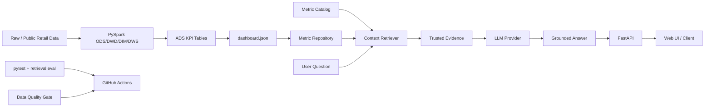

# RetailPulse AI Analyst

> 面向电商经营分析的 **AI 应用工程项目**：用 PySpark 湖仓产出可信指标，再由 FastAPI + LLM 将指标转成可追溯的经营问答与洞察。

这个仓库不再把“组件数量”当作工程化。核心目标是展示一条可解释、可测试、可部署的 AI 应用链路：

**离线数据加工 → 数据质量门禁 → 指标快照 → 业务指标检索 → LLM grounded answer → API / Web UI → eval / CI**

## 为什么适合 AI 应用开发岗

- **真实业务数据底座**：ODS / DWD / DIM / DWS / ADS 分层、PySpark 批处理、数据质量检查。
- **Grounded AI**：模型只能看到应用检索出的可信 KPI evidence，避免把 LLM 直接接到原始数据后自由发挥。
- **Provider 抽象**：配置 `OPENAI_API_KEY` 时调用 OpenAI Responses API；没有 Key 时自动使用 deterministic provider，便于本地开发与 CI。
- **工程化 API**：FastAPI、健康检查、readiness、request id、结构化日志、异常降级。
- **AI Eval**：离线 retrieval recall gate，不依赖外部模型也可以在 CI 阻止 grounding 退化。
- **可部署**：API 与湖仓依赖拆分；Docker 镜像只安装 AI 服务依赖，不把 PySpark 运行时硬塞进在线服务。
- **可解释前端**：回答同时展示 evidence，面试时能直接演示“答案来自哪些指标”。

## 架构



## 快速启动

### 1. 安装

```bash
python -m venv .venv
# Linux/macOS
source .venv/bin/activate
# Windows
# .\.venv\Scripts\activate

pip install -r requirements.txt
```

### 2. 启动 AI 服务

仓库自带一份小型 demo 指标，因此不运行 Spark 也能体验 AI 应用层。

```bash
uvicorn app.main:app --reload
```

浏览器访问：

```text
http://127.0.0.1:8000
```

API 文档：

```text
http://127.0.0.1:8000/docs
```

### 3. 可选：接入 OpenAI

```bash
export OPENAI_API_KEY="..."
export OPENAI_MODEL="gpt-5"
uvicorn app.main:app --reload
```

Windows PowerShell：

```powershell
$env:OPENAI_API_KEY="..."
$env:OPENAI_MODEL="gpt-5"
python -m uvicorn app.main:app --reload
```

没有 `OPENAI_API_KEY` 时不会报错，服务会使用 deterministic provider。这样单测和 CI 不依赖外部网络或 Token。

## API

### 健康检查

```bash
curl http://127.0.0.1:8000/healthz
curl http://127.0.0.1:8000/readyz
```

### 查看可信指标

```bash
curl http://127.0.0.1:8000/api/v1/metrics
```

### 经营问答

```bash
curl -X POST http://127.0.0.1:8000/api/v1/ask \
  -H "Content-Type: application/json" \
  -d '{"question":"支付转化率最近表现如何？","top_k":3}'
```

返回结构包含：

```json
{
  "request_id": "...",
  "answer": "...",
  "evidence": [
    {
      "metric": "pay_conversion_rate",
      "label": "支付转化率",
      "value": 0.8848,
      "definition": "支付成功订单数 / 下单订单数，分子分母均按订单去重。"
    }
  ],
  "provider": "deterministic",
  "model": "rules-v1",
  "warnings": [],
  "latency_ms": 1.42
}
```

## Grounding 设计

这里没有直接引入向量数据库。原因是当前知识域很小，主要是结构化经营指标和稳定指标口径；使用显式 metric catalog + keyword retrieval 更容易测试、解释和控制。

当业务知识扩展到大量活动规则、商品文档、客服知识或 SOP 后，再引入 embedding / vector store 更合理。面试时应能解释这个 trade-off，而不是为了“RAG”标签无条件增加基础设施。

LLM 输入由两部分组成：

1. 用户问题（不可信输入）。
2. 应用检索出的 trusted evidence，包括指标值、口径、数据源和可计算的日趋势。

系统提示要求模型：

- 只能使用 evidence；
- 不得虚构缺失指标、维度和原因；
- 区分“观察事实”和“原因假设”；
- evidence 不足时明确说明还需要什么数据。

## 在线服务与离线数据解耦

依赖拆为三组：

```text
requirements-api.txt   # FastAPI / Uvicorn / OpenAI
requirements-data.txt  # PySpark / Pandas / PyArrow
requirements-dev.txt   # pytest / httpx / ruff
```

Docker 只安装 `requirements-api.txt`。这比在在线 AI 服务中同时运行 Spark、PostgreSQL、MinIO、Hadoop 等未使用组件更贴近真实工程。

启动容器：

```bash
docker compose up --build
```

## 湖仓数据链路

快速生成模拟数据并跑完整 pipeline：

```bash
python scripts/run_all.py \
  --scale tiny \
  --start-date 2025-01-01 \
  --days 3 \
  --data-root data
```

导出在线 AI 应用可消费的指标：

```bash
python scripts/export_dashboard_data.py \
  --data-root data \
  --output dashboard/data/dashboard.json \
  --topn 10
```

服务优先读取：

```text
dashboard/data/dashboard.json
```

如果不存在，则回退到：

```text
dashboard/data/demo.json
```

## 测试与 AI Eval

```bash
pytest
python scripts/run_ai_evals.py --threshold 0.95
```

当前 eval 关注 **retrieval recall**：业务问题是否能召回正确 KPI。这个 gate 完全离线、确定性强，适合 CI。

后续可继续增加：

- answer faithfulness；
- answer relevance；
- cost / latency regression；
- prompt injection cases；
- provider timeout / rate limit chaos tests。

## CI

GitHub Actions 包含两个门禁：

1. **AI app quality**
   - 安装依赖
   - Ruff
   - pytest
   - retrieval eval
2. **Tiny lakehouse smoke**
   - Java 17 + PySpark
   - 跑 tiny end-to-end pipeline
   - 执行数据质量门禁
   - 上传质量报告 artifact

这样 CI 同时覆盖“AI 应用层”和“可信数据底座”，而不是只证明代码能 import。

## 目录

```text
app/
  analytics.py        # 指标仓库、缓存、趋势计算
  catalog.py          # 指标知识与检索
  llm.py              # OpenAI / deterministic provider
  service.py          # AI orchestration + fallback
  main.py             # FastAPI + observability
dashboard/
  index.html
  app.js
  styles.css
  data/demo.json
evals/
  retrieval_cases.json
jobs/                 # PySpark 湖仓任务
scripts/
  run_ai_evals.py
  generate_demo_data.py
  run_all.py
  run_quality_checks.py
tests/
docs/
  AI_APPLICATION.md
  DATA_WAREHOUSE_DESIGN.md
  METRICS.md
```

## 保留与删除的边界

保留：

- PySpark 湖仓与 SQL：作为 AI 应用可信数据源；
- Synerise 公开数据 pipeline：作为真实数据规模证明；
- 数据质量门禁：防止错误指标进入 AI 上下文；
- Windows Spark setup：支持现有本地开发链路。

删除：

- 未被核心代码使用的 Hadoop/HBase/Hive/Kafka/Flink/Sqoop/ZooKeeper “企业级配置模板”；
- PostgreSQL / MinIO 空壳 compose 服务；
- 670KB Three.js vendor 与 3D 大屏特效；
- Vercel / Node / Windows dashboard 启停脚本；
- 仅描述“企业级组件安装”的文档。

原则是：**每个保留组件都必须能解释它如何提升 AI 应用的准确性、可用性、可测试性或可部署性。**

## 面试可以重点讲

1. 为什么 AI 层不能直接相信 LLM，需要 trusted evidence。
2. 为什么当前检索没有上向量数据库，以及什么条件下会升级。
3. 如何让无 API Key 的 CI 仍然测试 AI 应用主链路。
4. 外部模型超时或失败时为什么需要 deterministic fallback。
5. 为什么在线 API 和 Spark 依赖要拆开。
6. 数据质量 gate 如何降低“垃圾数据 → 高质量幻觉”的风险。
7. retrieval eval 和传统 pytest 分别解决什么问题。

更完整的设计与面试问题见 `docs/AI_APPLICATION.md` 和 `docs/INTERVIEW_QA.md`。
