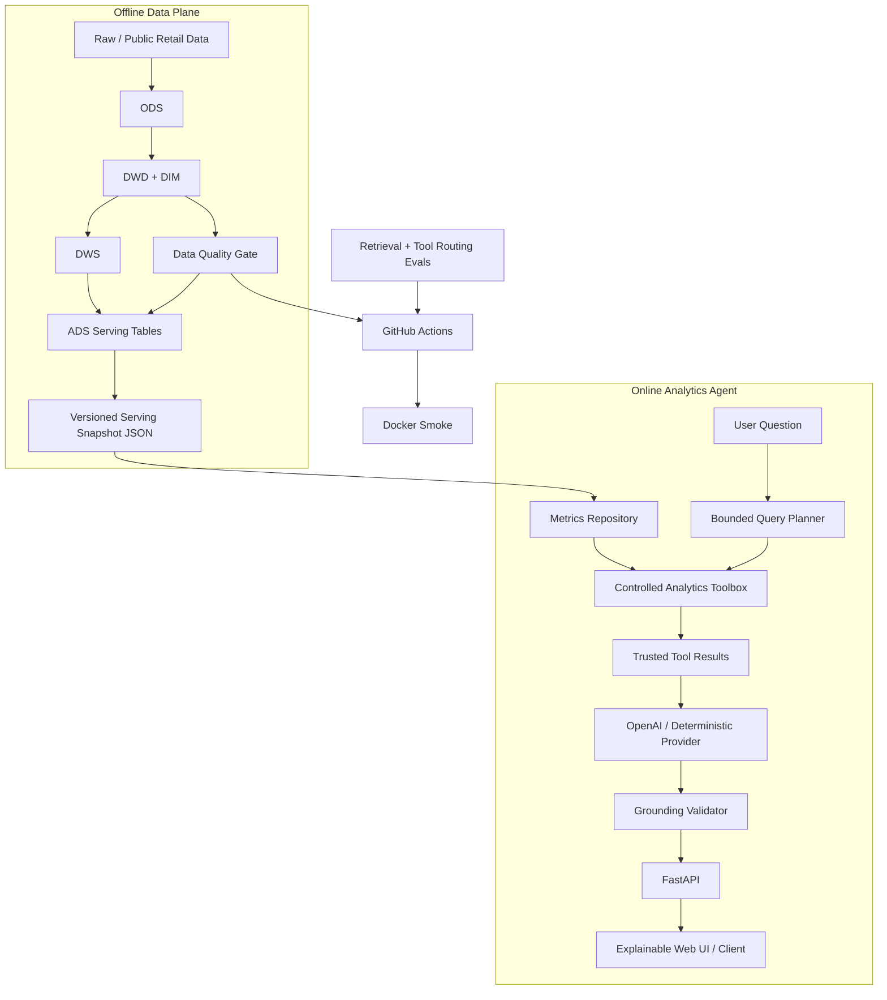

# Architecture

RetailPulse 采用 **离线可信数据平面 + 在线受控 AI 分析平面**。



## 关键边界

1. Spark 只跑离线计算，FastAPI 在线服务不启动 Spark/JVM。
2. ADS 导出成轻量 serving snapshot，内容 hash 作为 `data_version`。
3. Planner 不能生成任意 SQL、表名、路径或代码，只能选择白名单工具。
4. LLM 只看到成功的 ToolResult，并且每条 observation 必须引用本次 `evidence_key`。
5. 缺失维度显式进入 `coverage_gaps`，不让模型补造。
6. AI service、Docker image、Spark lakehouse 在 CI 中分开验证。

## Channel data contract

原始用户数据中的 `channel` 被定义为 **用户获客渠道**。`dim_user` 保留该字段，DWS 将订单、支付、退款事实按 `user_id -> channel` 聚合：

```text
dim_user.channel
  + dwd order/payment/refund
  -> dws_channel_day_summary
  -> ads_channel_summary
  -> dashboard.json.channel_summary
  -> breakdown_by_dimension(channel)
```

它与行为事件里的 `source_channel`（单次访问/事件来源）不是同一个口径。当前 Agent 支持 acquisition channel；若未来做 session attribution，需要单独建行为归因模型，不能混用两者。

## 为什么没有让 LLM 直接 Text-to-SQL

直接 Text-to-SQL 会扩大 schema 泄露、权限、资源扫描、指标口径绕过和 eval 空间。当前业务域优先使用 bounded tools。未来需要 ad-hoc 查询时，更合理的升级方向是受控 semantic query DSL，由后端编译成参数化 SQL。

详细见 `ANALYTICS_AGENT.md` 与 `OPERATIONS.md`。
