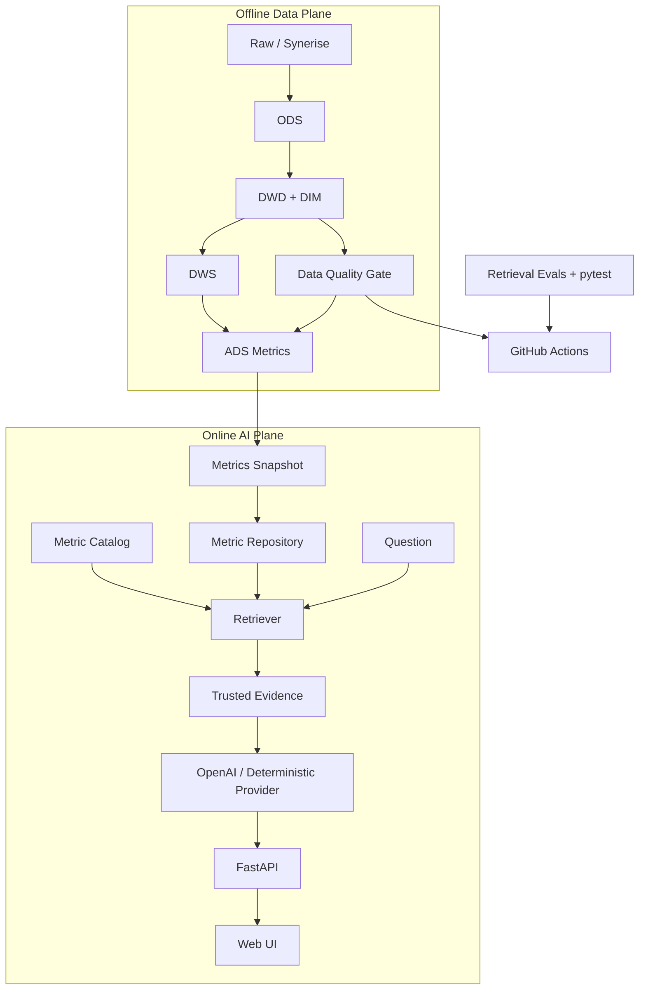

# Architecture

RetailPulse 采用“离线可信数据层 + 在线 AI 应用层”的双层架构。

关键边界：

- Spark 只负责离线数据计算；
- FastAPI 在线服务不启动 Spark；
- LLM 不直接读取任意原始表；
- evidence 是 AI 事实边界；
- provider 可以替换，业务 retrieval 不依赖具体模型厂商。

详细设计见 `AI_APPLICATION.md`。
