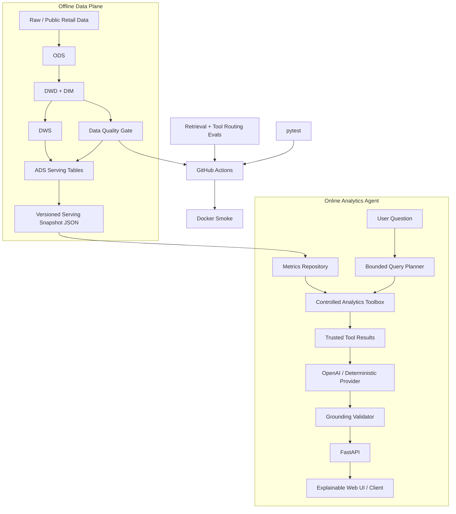

# Architecture

RetailPulse 采用 **离线可信数据平面 + 在线受控 AI 分析平面**。核心目标不是让模型自由查询数据库，而是让应用代码定义模型可以看到和执行的事实边界。



## 关键边界

1. **Spark 只跑离线计算。** FastAPI 在线服务不启动 JVM/Spark，避免把批处理依赖和在线延迟耦合。
2. **Serving snapshot 是在线数据契约。** ADS 表由导出脚本转成轻量 JSON，API 使用内容 hash 作为 `data_version`。
3. **Planner 不生成任意 SQL。** Planner 只能选择预定义工具和受控参数，不能指定表名、路径、Python 代码或 SQL 字符串。
4. **Toolbox 是事实执行边界。** 当前只允许 KPI、分期对比、维度下钻、Top-N、异常检测。
5. **LLM 只看到成功工具结果。** 每个结果带唯一 `evidence_key`；模型 observation 必须引用实际执行过的 key。
6. **缺失能力显式失败。** `channel`、`campaign`、`region` 等当前未进入 serving mart 的维度被返回为 coverage gap，不由模型猜测。
7. **在线和离线各自有 CI 门禁。** AI service、Docker 包装、Spark lakehouse 分开验证。

## Runtime data flow

```text
question
  -> QueryPlanner.plan()
  -> QueryPlan(calls, coverage_gaps)
  -> RetailToolbox.execute()
  -> ToolResult[]
  -> LLMProvider.generate(trusted_context)
  -> AnalysisContent
  -> grounding validation
  -> API response(plan + tool_results + analysis + evidence)
```

## 为什么没有让 LLM 直接 Text-to-SQL

当前项目的目标是经营分析服务，而不是通用数据库助手。直接让模型生成 SQL 会扩大风险面：

- schema/table 泄露；
- 不受控扫描导致延迟和成本不可预测；
- 指标口径容易被绕开；
- 权限隔离、SQL 注入和资源治理复杂度显著上升；
- eval 很难覆盖任意查询空间。

因此当前选择 **bounded tools over arbitrary SQL**。当需要更灵活的 ad-hoc 查询时，可以新增受控 semantic query DSL，由服务端编译成参数化 SQL，而不是把 SQL 生成权直接交给模型。

详细工具契约见 `ANALYTICS_AGENT.md`，生产运行约束见 `OPERATIONS.md`。
