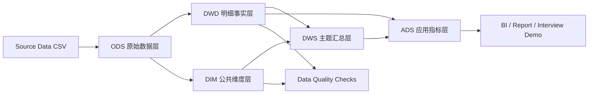
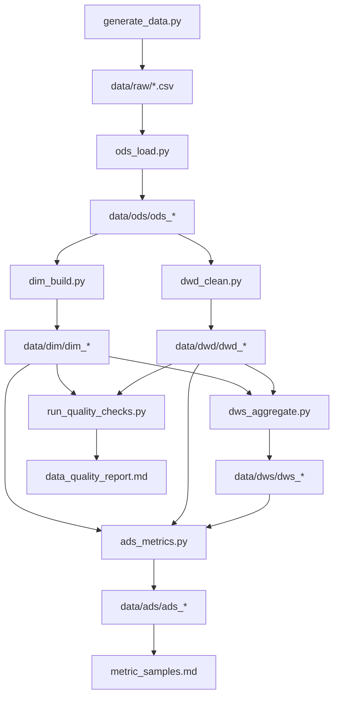

# 架构说明

## 总体架构



## 数据流



## 分层职责

| 层级 | 目录 | 职责 |
| --- | --- | --- |
| raw | `data/raw` | 模拟源系统 CSV 数据 |
| ODS | `data/ods` | 保留源表结构，统一格式和加载字段 |
| DWD | `data/dwd` | 清洗后的明细事实层，完成去重、标准化、基础校验 |
| DIM | `data/dim` | 用户、商品、店铺、品类、日期等公共维度 |
| DWS | `data/dws` | 按交易、用户、商品、店铺、品类、留存、库存汇总 |
| ADS | `data/ads` | 面向看板和分析场景的应用指标表 |

## 运行模式

默认运行模式为本地 PySpark：

```bash
python scripts/run_all.py --scale tiny
```

可选 Docker Compose 提供 Spark standalone、PostgreSQL 和 MinIO，主要用于展示真实数据平台组件如何组合。本项目的核心链路不依赖 Docker，方便 Windows 11 + VSCode 本地演示。

## 设计取舍

- 使用 CSV 作为源系统落地格式，降低本地生成和调试成本。
- 使用 Parquet 作为湖仓分层存储格式，模拟生产离线数仓常见实践。
- 使用 `dt` 分区，便于每日增量计算和质量校验。
- 指标链路优先保证口径清楚、可运行、可面试讲解。
- Docker 环境作为增强项，不影响本地 Python + PySpark 的最小闭环。

