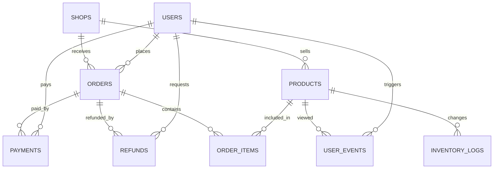

# 业务流程说明

RetailPulse 模拟一家电商零售平台的离线经营分析场景。业务核心围绕用户、商品、店铺、订单、支付、退款、行为和库存展开。

## 核心流程

1. 用户注册：用户通过自然流量、广告、社交、应用商店等渠道注册，形成用户基础属性。
2. 浏览商品：用户在 App、Web、小程序等终端浏览、搜索商品。
3. 加购收藏：用户将感兴趣商品加入购物车或收藏，为转化分析提供行为漏斗。
4. 下单：用户提交订单，订单包含店铺、收货城市、订单总额、优惠金额和应付金额。
5. 支付：订单支付生成支付流水，包含支付方式、支付状态和支付金额。
6. 发货：订单支付后进入履约流程，可在订单状态中体现。
7. 收货：用户确认收货后，交易进入完成状态。
8. 退款：用户因商品破损、发错货、价格保护等原因发起退款。
9. 评价：当前版本预留评价流程，可扩展评价表和商品评分指标。

## 业务实体

| 实体 | 主键 | 说明 |
| --- | --- | --- |
| 用户 | `user_id` | 用户基础属性、注册渠道、会员状态 |
| 商品 | `product_id` | 商品、品类、品牌、价格、归属店铺 |
| 店铺 | `shop_id` | 店铺类型、城市、开店时间、评分 |
| 订单 | `order_id` | 用户在店铺维度提交的交易单据 |
| 订单明细 | `order_item_id` | 订单中的商品行，支持商品 TopN 和品类分析 |
| 支付 | `payment_id` | 支付方式、支付状态、支付金额 |
| 退款 | `refund_id` | 退款原因、退款状态、退款金额 |
| 用户行为 | `event_id` | 浏览、搜索、加购、收藏、下单、支付事件 |
| 库存流水 | `inventory_log_id` | 商品库存出入库和调整记录 |

## 实体关系

## 典型分析问题

- 今天 GMV、订单量、支付金额是否增长？
- 哪些商品、品类、店铺贡献了主要销售额？
- 用户从浏览到支付的转化是否下降？
- 支付成功后退款率是否异常？
- 新用户次日和 7 日留存如何？
- 哪些用户属于高价值用户、潜力用户或流失风险用户？
- 哪些商品库存周转慢，可能产生滞销？

