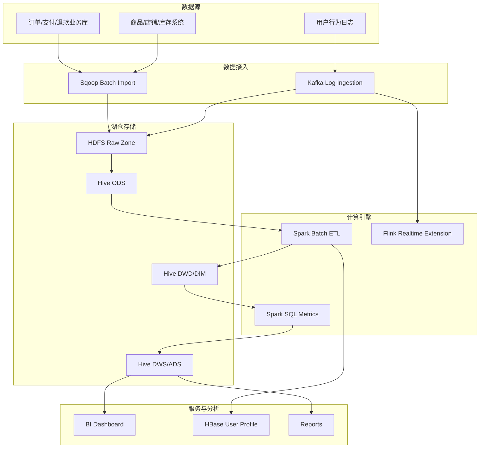

# 企业级架构扩展

## 从个人项目到企业项目

原始项目重点是证明一条离线数仓链路能在本地跑通。企业级扩展后，项目不再只是 PySpark 脚本集合，而是具备以下能力：

- 数据接入层：Kafka 接入行为日志，Sqoop 同步关系库业务数据。
- 存储层：HDFS 承载 raw/ods/dwd/dws/ads 数据目录，Hive 管理元数据。
- 计算层：Spark 负责离线批处理，Flink 预留实时指标计算。
- 服务层：HBase/Redis 可承接用户画像、商品画像和看板加速查询。
- 治理层：数据质量检查、指标口径文档、分层建模和性能优化文档。
- 运维层：统一 E 盘安装目录、环境变量脚本、配置模板和检查脚本。

## 企业级分层



## 数据目录规划

企业模式建议使用：

```text
hdfs://localhost:9000/warehouse/retailpulse/
  raw/
  ods/
  dwd/
  dim/
  dws/
  ads/
  quality/
  checkpoint/
```

本地 E 盘模拟目录：

```text
E:\RetailPulseEnterprise\data\
  hadoop\
  spark-warehouse\
  hive-warehouse\
  kafka-logs\
  zookeeper\
  hbase\
  flink\
```

## 企业级能力补充

| 能力 | 个人版 | 企业级扩展 |
| --- | --- | --- |
| 存储 | 本地 Parquet | HDFS + Hive 表 |
| 批处理 | PySpark local | Spark on YARN/Standalone |
| 实时 | 无 | Kafka + Flink |
| 元数据 | 目录约定 | Hive Metastore |
| 在线服务 | 无 | HBase/Redis 用户画像 |
| 数据同步 | Python 生成 | Sqoop/CDC/消息队列 |
| 运维 | 手工命令 | 环境脚本 + 配置模板 + 检查脚本 |

## 简历升级说法

可以把项目描述升级为：

> 独立设计并实现 RetailPulse 电商零售离线湖仓项目，完成从模拟业务数据、ODS/DWD/DIM/DWS/ADS 分层建模、PySpark 批处理、指标体系、数据质量校验到企业级 Hadoop/Spark/Hive/Kafka/Flink/HBase 组件化部署的完整链路。项目支持 Windows 本地可运行演示，并预留 HDFS/Hive/Kafka/Flink/HBase 的生产化扩展路径。
