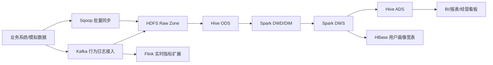

# 企业级本地部署说明

## 部署目标

RetailPulse 企业级模式使用官方安装包搭建本地大数据运行时。所有组件安装到 E 盘，并通过项目脚本持久化到 Windows 用户级环境变量。

默认安装目录：

```text
E:\RetailPulseEnterprise
  components\
  downloads\
  data\
  logs\
  tmp\
  component-manifest.txt
```

旧目录 `E:\BigData_Development\retailpulse-enterprise` 已删除，不再使用。

## 官方组件版本

| 组件 | 版本 | 安装目录 | 官方下载源 |
| --- | --- | --- | --- |
| Hadoop | 3.4.2 | `components/hadoop-3.4.2` | Apache Hadoop Downloads |
| Spark | 3.5.8 | `components/spark-3.5.8-bin-hadoop3` | Apache Spark Downloads |
| Hive | 4.2.0 | `components/apache-hive-4.2.0-bin` | Apache Hive Downloads |
| Kafka | 3.9.2 | `components/kafka_2.13-3.9.2` | Apache Kafka Downloads |
| ZooKeeper | 3.9.5 | `components/apache-zookeeper-3.9.5-bin` | Apache ZooKeeper Downloads |
| HBase | 2.6.4 | `components/hbase-2.6.4` | Apache HBase Downloads |
| Flink | 2.1.1 | `components/flink-2.1.1` | Apache Flink Downloads |
| Sqoop | 1.4.7 | `components/sqoop-1.4.7.bin__hadoop-2.6.0` | Apache Sqoop Archive |
| Sqoop 兼容依赖 | commons-cli 1.2 | `components/sqoop-1.4.7.bin__hadoop-2.6.0/lib` | Apache Maven Repository |
| Redis | stable source | `components/redis-stable` | Redis Official Downloads |
| Maven | 3.9.15 | `components/apache-maven-3.9.15` | Apache Maven Downloads |

说明：Redis 官方不提供现代 Windows 原生二进制包，因此项目安装的是官方源码包，用于架构和生产化迁移说明。
Sqoop 1.4.7 是较早期项目，脚本会额外放置 `commons-cli-1.2.jar` 并通过 `sqoop-env.cmd` 调整 classpath，使 `sqoop.cmd version` 能在当前 Java 17 + Hadoop 3.x 本地环境下输出版本。
每次安装都会生成 `E:\RetailPulseEnterprise\component-manifest.txt`，其中记录了实际下载 URL、安装目录和持久化范围，便于复盘和面试说明。

## 安装命令

```powershell
conda activate retailpulse-lakehouse
cd E:\Projects\retailpulse-offline-lakehouse

.\scripts\setup_enterprise_components.ps1 -InstallRoot E:\RetailPulseEnterprise -PersistScope User
```

脚本会自动完成：

- 从官方 URL 下载安装包到 `E:\RetailPulseEnterprise\downloads`。
- 解压到 `E:\RetailPulseEnterprise\components`。
- 应用 `configs/enterprise/` 下的 Hadoop/Spark/Hive/Kafka/ZooKeeper/HBase/Sqoop/Flink 配置。
- 给 Kafka 创建短路径别名 `E:\rp-kafka`，规避 Windows bat classpath 过长问题。
- 持久化 `HADOOP_HOME`、`SPARK_HOME`、`HIVE_HOME`、`KAFKA_HOME`、`ZOOKEEPER_HOME`、`HBASE_HOME`、`SQOOP_HOME`、`FLINK_HOME`、`REDIS_HOME`、`MAVEN_HOME` 和用户级 `Path`。

只加载当前会话环境：

```powershell
.\scripts\use_enterprise_env.ps1 -InstallRoot E:\RetailPulseEnterprise
```

重新应用配置：

```powershell
.\scripts\apply_enterprise_configs.ps1 -InstallRoot E:\RetailPulseEnterprise
```

检查环境：

```powershell
.\scripts\check_enterprise_env.ps1 -InstallRoot E:\RetailPulseEnterprise
```

## 当前验证结果

在 Windows 11 + Java 17 环境下已验证：

| 组件 | 检查结果 |
| --- | --- |
| Java | 可识别 |
| Hadoop 3.4.2 | `hadoop version` 可运行 |
| Spark 3.5.8 | `spark-submit.cmd --version` 可输出版本 |
| Maven 3.9.15 | `mvn.cmd --version` 可运行 |
| Kafka 3.9.2 | 通过 `E:\rp-kafka` 短路径后 `kafka-topics.bat --version` 可运行 |
| HBase 2.6.4 | 已覆盖 `hbase-env.cmd`，移除 Java 17 不支持的 CMS GC 参数，`hbase.cmd version` 可运行 |
| ZooKeeper 3.9.5 | `.cmd` 脚本存在 |
| Hive 4.2.0 | 官方包以 shell 脚本为主，Windows 原生启动能力有限 |
| Flink 2.1.1 | 官方包以 shell 脚本为主，Windows 原生启动能力有限 |
| Sqoop 1.4.7 | 已加入 `commons-cli-1.2.jar` 兼容配置，`sqoop.cmd version` 可输出版本；HCatalog/Accumulo 属于可选集成，未配置时会显示提示 |
| Redis stable | 官方源码包已安装；Windows 原生服务建议使用 WSL/Linux/Docker |

## 企业级架构映射



当前可运行主链路仍是：

```text
CSV raw -> PySpark ODS/DWD/DIM/DWS/ADS -> Parquet -> Quality Report
```

Spark 官方组件版本和项目 `requirements.txt` 中的 `pyspark` 版本保持一致，都是 3.5 系列。
