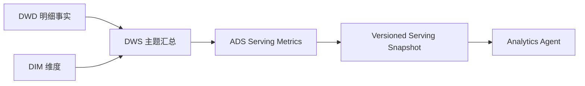

# 指标口径说明

## 核心指标

| 指标 | 业务解释 | 计算公式 | 依赖 | 层级 |
|---|---|---|---|---|
| GMV | 下单形成的交易规模 | `sum(payable_amount)`，订单去重 | `dws_trade_day_summary` | ADS |
| 订单量 | 用户提交订单数 | `count(distinct order_id)` | DWS trade | ADS |
| 支付订单量 | 成功支付订单数 | `count(distinct order_id where pay_status='success')` | DWS trade | ADS |
| 支付金额 | 成功支付流水金额 | `sum(pay_amount where pay_status='success')` | DWS trade | ADS |
| 支付转化率 | 下单后完成支付比例 | `pay_order_count / order_count` | DWS trade | ADS |
| 客单价 | 每笔支付订单平均金额 | `pay_amount / pay_order_count` | DWS trade | ADS |
| 退款率 | 退款金额对支付金额影响 | `approved_refund_amount / pay_amount` | DWS trade | ADS |
| 复购率 | 日内多次支付用户比例 | `pay_order_count>=2 用户 / pay_user_count` | DWS user | ADS |
| 商品销售 TopN | 商品销售排行 | `row_number over(dt order by sales_amount desc)` | DWS product | ADS |
| 品类销售 TopN | 品类销售排行 | 同上 | DWS category | ADS |
| 店铺销售排行 | 店铺经营排行 | 同上 | DWS shop | ADS |
| RFM 用户分层 | 用户价值分层 | recency / frequency / monetary | DWD payment | ADS |
| 库存周转率 | 库存消耗效率 | `sales_quantity / avg_inventory` | DWS inventory/product | ADS |

## 关键口径

### GMV vs 支付金额

GMV 统计订单应付金额，反映下单盘子；支付金额只统计成功支付，二者不能混用。

### 支付转化率

```text
支付转化率 = 支付成功订单数 / 下单订单数
```

分子分母均按订单去重。分期汇总时必须重新聚合分子分母，不能简单平均日转化率。

### 客单价

```text
客单价 = 支付金额 / 支付成功订单数
```

同样不能对 daily AOV 做简单平均。

### 退款率

```text
退款率 = 审核通过退款金额 / 成功支付金额
```

当前使用金额退款率；如需订单退款率，应作为独立指标建模。

## Channel 指标

### 业务定义

`dim_user.channel` 是 **用户获客/注册渠道**。它与 `dwd_user_behavior_detail.source_channel` 的单次事件来源不同，二者不能混用。

### 数据链路

```text
ods_users.channel
  -> dim_user.channel
  -> join dwd order/payment/refund by user_id
  -> dws_channel_day_summary
  -> ads_channel_summary
  -> serving snapshot channel_summary
  -> Agent breakdown_by_dimension(channel)
```

### 渠道指标

`dws_channel_day_summary` 对每个 `dt + channel` 计算：

- `order_count`
- `order_user_count`
- `gmv`
- `pay_order_count`
- `pay_user_count`
- `pay_amount`
- `pay_conversion_rate = pay_order_count / order_count`
- `avg_order_value = pay_amount / pay_order_count`
- `refund_order_count`
- `refund_amount`
- `refund_rate = refund_amount / pay_amount`

这使“按渠道分析 GMV/支付金额/转化率/客单价/退款率”成为真实数据能力，而不是 prompt 声称的能力。

## RFM

- R：最近一次支付距离统计日期的天数，越近越高。
- F：支付成功订单数，越多越高。
- M：支付成功金额，越高越高。

用户标签包括高价值、潜力、流失风险和一般用户。

## 指标链路


