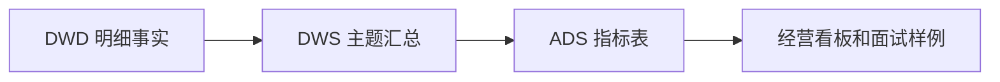

# 指标口径说明

## 口径总览

| 指标 | 业务解释 | 计算公式 | SQL 文件 | 依赖表 | 层级 | 面试解释话术 |
| --- | --- | --- | --- | --- | --- | --- |
| GMV | 用户提交订单形成的交易规模 | `sum(payable_amount)`，按订单去重 | `sql/ads/gmv.sql` | `dws_trade_day_summary` | ADS | GMV 统计下单金额，不要求支付成功，适合看业务盘子。 |
| 订单量 | 用户提交订单数 | `count(distinct order_id)` | `sql/ads/order_count.sql` | `dws_trade_day_summary` | ADS | 订单量反映下单行为规模，和支付订单量区分。 |
| 下单用户数 | 发生下单行为的用户数 | `count(distinct user_id)` | `sql/ads/order_user_count.sql` | `dws_trade_day_summary` | ADS | 用于判断下单覆盖用户规模。 |
| 支付订单量 | 支付成功订单数 | `count(distinct order_id where pay_status='success')` | `sql/ads/pay_order_count.sql` | `dws_trade_day_summary` | ADS | 支付订单量只看成功支付，是收入相关指标基础。 |
| 支付用户数 | 支付成功用户数 | `count(distinct user_id where pay_status='success')` | `sql/ads/pay_user_count.sql` | `dws_trade_day_summary` | ADS | 支付用户数用于计算客群转化和复购。 |
| 支付金额 | 成功支付流水金额 | `sum(pay_amount where pay_status='success')` | `sql/ads/pay_amount.sql` | `dws_trade_day_summary` | ADS | 支付金额比 GMV 更接近实际收入。 |
| 支付转化率 | 下单后完成支付的比例 | `pay_order_count / order_count` | `sql/ads/pay_conversion_rate.sql` | `dws_trade_day_summary` | ADS | 分子分母都按订单去重，避免明细行重复。 |
| 客单价 | 每笔支付订单平均金额 | `pay_amount / pay_order_count` | `sql/ads/avg_order_value.sql` | `dws_trade_day_summary` | ADS | 客单价用于分析价格带、活动和用户消费能力。 |
| 退款率 | 支付后发生退款的比例 | `approved_refund_amount / pay_amount` | `sql/ads/refund_rate.sql` | `dws_trade_day_summary` | ADS | 金额口径能体现退款对收入的影响。 |
| 复购率 | 当日多次支付用户比例 | `pay_order_count>=2 的用户数 / pay_user_count` | `sql/ads/repeat_purchase_rate.sql` | `dws_user_day_summary` | ADS | 这里采用日内复购口径，项目中可扩展为 30 日复购。 |
| 次日留存率 | cohort 用户次日仍活跃比例 | `D1 retained users / cohort users` | `sql/ads/next_day_retention.sql` | `dws_user_retention_summary` | ADS | 留存基于行为活跃，不依赖支付。 |
| 7 日留存率 | cohort 用户第 7 日仍活跃比例 | `D7 retained users / cohort users` | `sql/ads/seven_day_retention.sql` | `dws_user_retention_summary` | ADS | 7 日留存适合观察用户持续访问质量。 |
| 商品销售 TopN | 商品销售排行 | `row_number over(dt order by sales_amount desc)` | `sql/ads/product_topn.sql` | `dws_product_day_summary` | ADS | 排名基于商品销售额，销量作为辅助排序。 |
| 品类销售 TopN | 品类销售排行 | `row_number over(dt order by sales_amount desc)` | `sql/ads/category_topn.sql` | `dws_category_day_summary` | ADS | 品类排行帮助识别主要增长品类。 |
| 店铺销售排行 | 店铺经营排行 | `row_number over(dt order by sales_amount desc)` | `sql/ads/shop_rank.sql` | `dws_shop_day_summary` | ADS | 店铺排名可用于运营资源分配。 |
| RFM 用户分层 | 用户价值分层 | `R: recency, F: frequency, M: monetary` | `sql/ads/rfm_user_segment.sql` | `dwd_trade_payment_detail` | ADS | 用最近消费、消费频次和金额把用户分成高价值、潜力、流失风险等。 |
| 库存周转率 | 库存消耗效率 | `sales_quantity / avg_inventory` | `sql/ads/inventory_turnover.sql` | `dws_inventory_day_summary`、`dws_product_day_summary` | ADS | 周转率越高说明库存消耗越快，过低可能滞销。 |

## 关键口径细节

### GMV 与支付金额

GMV 采用下单应付金额，反映用户提交订单时形成的交易规模。支付金额只统计成功支付流水，反映实际支付结果。两者差异可以用于分析取消、未支付和支付失败。

### 支付转化率

支付转化率使用订单口径：

```text
支付转化率 = 支付成功订单数 / 下单订单数
```

不使用订单明细行作为分母，避免一个订单多个商品行导致重复计算。

### 退款率

当前项目使用金额退款率：

```text
退款率 = 审核通过退款金额 / 成功支付金额
```

也可以扩展订单退款率：

```text
订单退款率 = 发生退款订单数 / 支付成功订单数
```

### 留存

留存基于用户行为活跃。某日发生任意合法行为的用户构成 cohort，第 1 天或第 7 天仍活跃则计为留存。

### RFM

- R：最近一次支付距离统计日期的天数，越近越高。
- F：统计周期内支付成功订单数，越多越高。
- M：统计周期内支付成功金额，越高越高。

用户标签：

- 高价值用户：R、F、M 均较高。
- 潜力用户：最近活跃且频次较高。
- 流失风险用户：最近一次支付时间较久。
- 一般用户：其他用户。

## 指标链路



